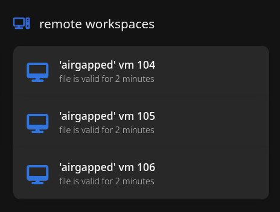

# pve-spice-puller

> ***small daemon utility for tunneling spice configs to users***

## what

- exposes a webhook using tiny http
- sends POST to PVE instance when said webhook is GET'ed
- receives spiceconfig from PVE, digests it, drops it onto user in proper .vv format

## why

i needed a way to let my colleagues to connect to "airgapped" vms but didn't want to make a user for each one

## danger

not to be used in any serious deployment, this thing is so unsafe i wonder how rust even runs it

- tls is forcefully disabled (!)
- no auth apart from api token, vms are exposed to whoever has the .vv file
- a lot of unwraps and not a lot of proper error handling
- written by an idiot

## usage

- make necessary preparations in PVE:
  - create a user and a group
  - give this group `VM:Console` perms
  - assign this group to vm(s) you want to expose
- pull
- populate `.env.template` with credentials from PVE and other info, save as `.env`
- run it as is with `cargo run` in detached state
- or `cargo build` and make a service out of this, i don't really care lol
- go to `http://{your_webhook_address}/get_config/{vm_id}`
- or make this a clickable link on some homepage, like [homer](https://github.com/bastienwirtz/homer)

> this was created out of desperation and boredom
