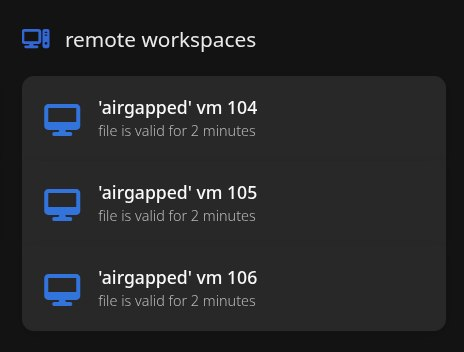

# pve-spice-puller

> ***small daemon utility for tunneling spice configs to users***

## what

- exposes a webhook using tiny http
- sends POST to PVE instance when said webhook is GET'ed
- receives spiceconfig from PVE, digests it, drops it onto user in proper .vv format

## why

i needed a way to let my colleagues to connect to "airgapped" vms but didn't want to make a user for each one

## danger

not to be used in any serious deployment, this thing is so unsafe i wonder how rust even runs it

- no auth apart from api token, vms are exposed to whoever has the .vv file
- a lot of unwraps and not a lot of proper error handling
- written by an idiot

## usage

- make necessary preparations in PVE:
  - create a user and a group
  - give this group `VM:Console` perms
  - assign this group to vm(s) you want to expose
- pull
- populate `.config.template` with credentials from PVE and other info, save as `.config`
- run it as is with `cargo run` in detached state
- or `cargo build` and make a service out of this, i don't really care lol
- go to `http://{your_webhook_address}/get_config/{vm_id}`
- or make this a clickable link on some homepage, like [homer](https://github.com/bastienwirtz/homer)


### TLS

pve-spice-puller now has proper TLS verification by default.
it uses system CA certificates out of the box, but since PVE
usually runs with a self-signed cert, you'll need to feed it
your PVE's CA cert:

1. grab the CA cert from your PVE node:
   `/etc/pve/local/pve-ssl.pem` (or your own CA if you're fancy)
2. copy it to the machine running the daemon
3. add this to `.config`:
   ```
   ca-cert = /path/to/that/pve-ssl.pem
   ```

if you can't be bothered, slap `--no-cert` on the command line
and the daemon will yell a warning at startup before running
insecurely like before.

you can also override the config path with `--config /some/other/path`.

### `.config` reference

| key | required | description |
|---|---|---|
| `pve` | yes | your pve instance ip:port |
| `name` | yes | token id |
| `token` | yes | token secret |
| `node` | yes | pve node name |
| `listen-on` | yes | where to listen for webhook, ip:port |
| `ca-cert` | no | path to pve ca certificate .pem |

### cli flags

| flag | description |
|---|---|
| `--no-cert` | disable tls verification (insecure, warns at startup) |
| `--config <path>` | use a specific config file instead of auto-detect |

> this was created out of desperation and boredom
